# [DIO](www.dio.me) - Trilha Java Básico desafioDioIPhoneJavaIA
repositorio para entrega de desafio no curso de IA aplicado com JAVA

## Autores
- [Gleyson Sampaio](https://github.com/glysns)

### Entrega Desenvolvida por
- [Tiago Ferreira Rodrigues](https://github.com/guruck)

## POO - Desafio

### Modelagem e Diagramação de um Componente iPhone

Neste desafio proposto para completude do aprendizado de UML, somos responsáveis por modelar e diagramar a representação UML do componente iPhone, abrangendo suas funcionalidades como Reprodutor Musical, Aparelho Telefônico e Navegador na Internet.

#### Contexto
Com base no vídeo de lançamento do iPhone de 2007 (link abaixo), elaboramos a diagramação das classes e interfaces utilizando uma ferramenta UML de nossa preferência. Em seguida, implementaremos as classes e interfaces no formato de arquivos `.java`.

[Lançamento iPhone 2007](https://www.youtube.com/watch?v=9ou608QQRq8)
- Minutos relevantes: 00:15 até 00:55

#### Funcionalidades a Modelar Sugeridas
1. **Reprodutor Musical**
   - Métodos: `tocar()`, `pausar()`, `selecionarMusica(String musica)`
2. **Aparelho Telefônico**
   - Métodos: `ligar(String numero)`, `atender()`, `iniciarCorreioVoz()`
3. **Navegador na Internet**
   - Métodos: `exibirPagina(String url)`, `adicionarNovaAba()`, `atualizarPagina()`

### Objetivo
1. Criar um diagrama UML que represente as funcionalidades descritas acima.
2. Implementar as classes e interfaces correspondentes em Java (Opcional).

### Instruções
1. Assista ao vídeo do lançamento do iPhone para entender as funcionalidades principais.
2. Utilize uma ferramenta UML de sua preferência para criar o diagrama das classes e interfaces. Você pode utilizar o modelo acima (criado na sintaxe [Mermaid](https://mermaid.js.org/)), uma alternativa open-source e compatível com arquivos Markdown como este.
3. Opcionalmente, caso esteja cheio(a) de confiança, pode implementar as classes Java representadas em seu diagrama UML.
4. Submeta seu repositório GitHub conforme as orientações da plataforma DIO. Por exemplo:


```bash
https://github.com/glysns/trilha-java-basico/desafios/poo/README.md
```

### Conforme Observações
O desafio proposto acaba se tornando mais amplo se tratando de um produto nos tempos de hoje 2024, ja conhecido e não mais inovador, mas, pensando em 2007 quando revoluciona o modo de se conhecer o "SmartPhone" deveras temos que concordar que revolucionou o mercado.

Não apenas pela unificação de se ter um telefone que toca as musicas favoritas e tem um gerenciamento melhorado de chamadas telefonicas, contatos, internet, seleção automatica de banda, chamada em espera, conferencia, mensagem de voz, zoom em fotos, imagens mais nítidas, entre outras funcionalidades no tempo jamais vistas.

O que temos que observar além do marketing, da união de grandes empresas para entregar o produto Apple, Yahoo, Google... da sacada de precificação para trazer valor agregado ao produto entregando 2 ou mais aparelhos que andavam soltos em apenas 1 que ainda por cima entregava muito mais em tecnologia e por um preço aparentemente justo.

Varios insites não apenas de UML podemos destacar nesse desafio pensando no proposito hoje de Inteligência Artificiais entregando cada vez mais potência em nos auxiliar no dia a dia para pesquisas de benchmark, estruturação de ideias, imagens, propagandas e textos.

Hoje gastei um tempo para escrever aqui nesse texto ideias e não aproveitei desse recurso pois muito vem do sentimento de ter vivenciado o momento mesmo de transformação da era de telefones móveis, telefones de linha, de chip, com mensagem SMS, depois os primeiros SMARTS até os conhecidos de hoje com verdadeiro poder computacional que não tinhamos acesso ou sequer noção que chegariamos nesse nível que temos hoje, sabendo que a inovação não para e que temos que buscar cada dia mais aprimorar nossos conhecimentos.

A modelagem não ficou das melhores, pois na ferramenta para pensar e analisar todos os conceitos em curto espaço de tempo para um projeto grandioso é complexo e obviamente deve ser pensado, repensado, colocado e aplicado os pilares adequados para as classes, bem como ver se cada uma faz apenas o proposto correto... enfim, é algo que com certeza se eu mesmo olhar dias e dias, ao passar algum tempo voltarei a olhar e vai ter refatoração, vai ter melhorias e componentes novos.

### Diagrama UML Desenvovido com Mermaid

```mermaid
classDiagram
    class Musica{
        -titulo : string
        -artista : string
        -album : string
        -genero : string
        -caminhoArquivo : string
        -audio : audio
        -ano : int
        -tempoFaixa : double
        -favoritos: boolean
    }

    class Album{
        -capa : imagem
        -Musicas : List~Musica~
    }

    class Playlist{
        -nome: string
        -musicas: List~Musica~
        +adicionarMusica(musica: Musica)
        +RemoverMusica(musica: Musica)
    }
    class Reprodutor {
        <<interface>>
        + tocar()
        + proximo()
        + anterior()
        + pausar()
        + selecionarTempo()
        + isReproduzindo()
    } 
    class EstadoReproducao{
        <<enumeration>>
        PARADO
        REPRODUZINDO
        PAUSADO
    }

    class ReprodutorMusical {
        -playlistAtual : Playlist
        -playlist : List~Playlist~
        -album : List~Album~
        -albumAtual : Album
        -musicaAtual: Musica
        -modoAleatorio: boolean
        -estadoReproducao: EstadoReproducao

        +selecionarMusica(musica: Musica)
        +selecionarAlbum(album: string)
        +selecionarPlaylist(playlist: string)
        +selecionatModoAleatorio()
        +favoritarMusica(musica: Musica)
    }

    class Telefone{
        -numero: string
    }

    class Email{
        email : string
    }

    class Contato{
        -nome : string
        -telefones : List~Telefone~
        -e-mails : List~Email~
        -endereco : string
        -avatar : imagem
        -favorito : boolean
        +criar(string nome, List~Telefone~, List~Email~, imagem avatar, boolean favorito)
        +editar()
        +deletar()
        +marcarContatoFavorito()
    }

    class AparelhoTelefonico {
        - recentes : List~Contato~
        - contatos : List~Contato~
        +ligar(string numero)
        +atender()
        +iniciarCorreioVoz()
        +adicionarContato(Contato contato)
        +colocarEmEspera()
        +colocarEmConferencia()
        +mutarMicrofone()
        +ativarVivaVoz()
        +visualizarTecladoNumerico()
    }

    class NavegadorInternet {
        -historico : List~string~
        -favoritos : List~string~
        -zoom : int
        +exibirPagina(String url)
        +adicionarNovaAba()
        +atualizarPagina()
        +voltarPaginaAnterior()
        +avancarPagina()
        +zoom()
    }

    class iPhone {
    }

    iPhone --> Reprodutor
    iPhone --> AparelhoTelefonico
    iPhone --> NavegadorInternet

    Contato "1" --> "*" Telefone
    Contato "1" --> "*" Email

    AparelhoTelefonico "0" --> "*" Contato

    Album "1" --> "*" Musica
    Playlist "1" --> "*" Musica

    Reprodutor <|-- ReprodutorMusical : implements
    Reprodutor <|-- EstadoReproducao : implements

    ReprodutorMusical "0" --> "*" Album
    ReprodutorMusical "0" --> "*" Playlist
    ReprodutorMusical --> EstadoReproducao

    note for ReprodutorMusical "pode tocar\npode passar proxima\npode pausar\npode voltar\npode selecionar um tempo da musica\nmodo aleatorio para tocar as musicas\npode tocar um album ou uma playlist\npode favoritar a musica"
    note for iPhone "a qualquer momento um APP pode ser colocado em espera\nsem interrupção abrupta guarda o estado e quando\nretomado uso deve voltar no ponto que estava\nos controles devem ser fluidos com simples toque e gestos"
    note for AparelhoTelefonico "interface UX conter modos para:\nmute\nteclado\npause\nviva-voz\ncolocar em espera\nconferência com + de uma ligação simultanea"
    note for Contato "uma lista simples que armazena diversas informações uteis\nao toque de uma barra lateral de caracteres navegar de forma rapida\ne ao clicar fornecer opção para usar funcionalidades gerais"
    note for Album "um titulo autoral musical protegido\no album tem uma coletania de musicas\nno iPod esse direito autoral é resguardado \ne deve ser obtido mediante compra \nna appleMusicStore"
    note for Telefone "aceitar caracateres numericos que possam\nrealizar a chamada entre dois dispositivos\naplicar MASCARA (ddd)ddddd-dddd\nquando numero exato"
    note for NavegadorInternet "ao se deparar com texto que corresponda a um TELEFONE\ndeve permitir realizar a ligacao a partir desse 'link'\ntambém será possivel interagir com demais apps do aparelho"
```


## Visibility
- \+ Public
- \- Private
- \# Protected
- \~ Package/Internal
